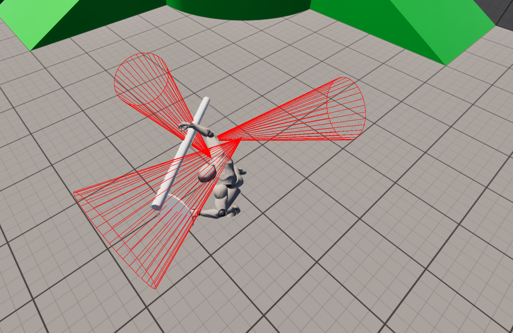
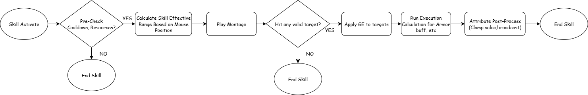

# Mythos - Unreal Engine 5 GAS Combat System

<div align="center">
  
</div>

## 📖 Overview

Mythos is a modular RPG combat system built in Unreal Engine 5 using the Gameplay Ability System (GAS).
The project focuses on scalable architecture, precise damage calculation, and sophisticated skill targeting to support complex combat scenarios.

## ✨ Key Features

### Attribute System
- Health, Mana, Stamina with max constraints
- Combat stats: Attack Power, Defense, Critical Chance, Critical Damage
- Real-time monitoring with delegates for responsive UI/gameplay feedback

### Damage Calculation
- Multi-factor formulas with Attack Power, Defense, and Critical mechanics
- Modular Execution Calculations for damage and healing
- Configurable critical multipliers and defense-based damage reduction

### Skill Targeting
- Mouse-based range checks with vector math for distance validation
- Area of Effect (AoE) calculations from cursor position
- Debug visualization for skill range and targeting feedback

### Combat Mechanics
- Extensible and modular skill system
- Critical hit system with adjustable multipliers
- Defense-driven mitigation ensuring balanced encounters

## 🎯 Skill Targeting System

<div align="center">
  
  <p><em>Precise mouse-based skill targeting with range validation</em></p>
</div>

## 🏗️ Architecture Overview

<div align="center">
  
  <p><em>Modular GAS framework architecture</em></p>
</div>

## 🛠️ Implementation Details

- Developed a delegate-driven event system for real-time updates of attributes and UI
- Designed Execution Calculations in GAS to separate logic for damage and healing
- Implemented vector math and AoE range checks for accurate skill targeting
- Followed Unreal Engine best practices for clean C++ architecture and extensibility

## 🚀 Getting Started

### Prerequisites
- Unreal Engine 5.0 or later
- Visual Studio 2019/2022 (Windows) or Xcode (macOS)

### Installation
1. Clone the repository:
   ```bash
   git clone https://github.com/xxsKyrreZLX/GasFrame.git
   ```

2. Open the project in Unreal Engine 5
3. Compile the project
4. Run the project

## 📁 Project Structure

```
Mythos/
├── Source/
│   └── Mythos/
│       ├── Core/
│       │   └── AbilitySystem/
│       │       ├── Abilities/
│       │       ├── Component/
│       │       └── Character/
│       ├── MythosCharacter.cpp
│       ├── MythosGameMode.cpp
│       └── MythosPlayerController.cpp
├── Content/
│   ├── Blueprints/
│   ├── Characters/
│   ├── Enemies/
│   └── ThirdPerson/
├── Images/
│   ├── cover.jpg
│   ├── MouseSkillDirection.jpg
│   └── MythosGASFrame.png
└── README.md
```

## 🎮 Features in Action

The system supports:
- **Real-time attribute monitoring** with visual feedback
- **Precise skill targeting** with mouse-based range validation
- **Modular damage calculations** with critical hit mechanics
- **Extensible ability system** for easy skill creation

## 🤝 Contributing

1. Fork the repository
2. Create your feature branch (`git checkout -b feature/AmazingFeature`)
3. Commit your changes (`git commit -m 'Add some AmazingFeature'`)
4. Push to the branch (`git push origin feature/AmazingFeature`)
5. Open a Pull Request

## 📄 License

This project is licensed under the MIT License - see the [LICENSE](LICENSE) file for details.

## 🙏 Acknowledgments

- Built with Unreal Engine 5
- Uses the Gameplay Ability System (GAS) framework
- Inspired by modern RPG combat mechanics

